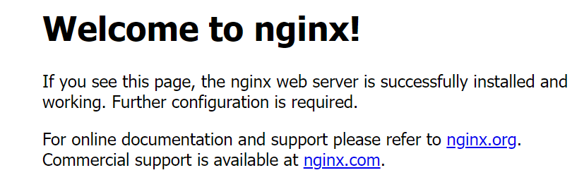
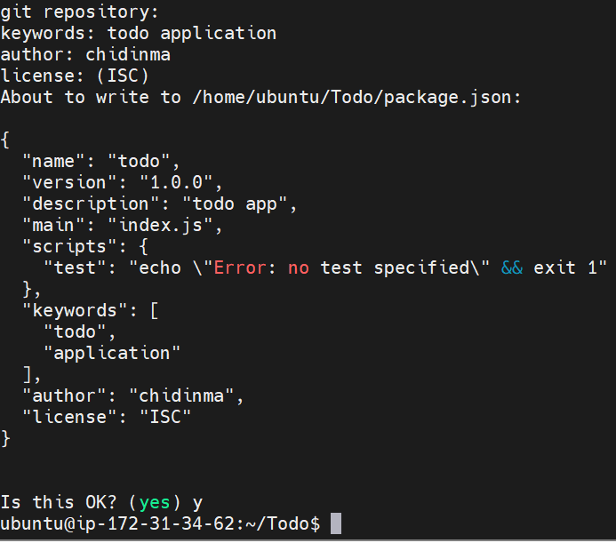

### LEMPSTACK PROJECT
#### CREATING YOUR INSTANCE
- Create an ec2 t2 family micro ubuntu server on 22.04.
#### INSTALLING THE NGINX WEB SERVER
```
sudo apt update
sudo apt install nginx
```
- When prompted press Y to confirm you want to install.
```
sudo systemctl status nginx
```
- To ensure nginx has been installed.
- Edit inbound rule in your instance and open port Tcp 80.
- Open your web browser and paste this:
```
http://<Public-IP-Address>:80
```

#### INSTALLING MY SQL
```
 sudo apt install mysql-server
```
- When prompted press Y.
```
sudo mysql
```
exit my sql shell with
```
exit
```
- Start the interactive script by running.
```
sudo mysql_secure_installation
```
- Answer Y for yes, or anything else to continue without enabling.
```
sudo mysql -p
mysql>exit
```
##### INSTALLING PHP
```
sudo apt install php-fpm php-mysql
```
- When prompted type Y.
##### CONFIGURING NGINX TO USE PHP
```
sudo mkdir /var/www/projectLEMP
sudo chown -R $USER:$USER /var/www/projectLEMP
sudo vi /etc/nginx/sites-available/projectLEMP
```
- This will create a blank space paste this into the space.
```
#/etc/nginx/sites-available/projectLEMP
 
server {
	listen 80;
	server_name projectLEMP www.projectLEMP;
	root /var/www/projectLEMP;
 
	index index.html index.htm index.php;
 
	location / {
    	try_files $uri $uri/ =404;
	}
 
	location ~ \.php$ {
    	include snippets/fastcgi-php.conf;
    	fastcgi_pass unix:/var/run/php/php8.1-fpm.sock;
 	}
 
	location ~ /\.ht {
    	deny all;
	}
 
}
```
```
sudo nginx -t
```
- You shall see following message:
nginx: the configuration file /etc/nginx/nginx.conf syntax is ok
nginx: configuration file /etc/nginx/nginx.conf test is successful.
- We also need to disable default Nginx host that is currently configured to listen on port 80, for this run:
```
sudo unlink /etc/nginx/sites-enabled/default
```
When you are ready, reload Nginx to apply the changes:
```
sudo systemctl reload nginx
```
- Your new website is now active, but the web root /var/www/projectLEMP is still empty. Create an index.html file in that location so that we can test that your new server block works as expected:
```
sudo echo 'Hello LEMP from hostname' $(curl -s http://169.254.169.254/latest/meta-data/public-hostname) 'with public IP' $(curl -s http://169.254.169.254/latest/meta-data/public-ipv4) > /var/www/projectLEMP/index.html
```
- Now go to your browser and open this:
```
http://<Public-IP-Address>:80
```
#### TESTING PHP WITH NGINX
```
sudo vi /var/www/projectLEMP/info.php
```
- Paste this into the space
```
<?php
phpinfo();
```

####  RETRIEVING DATA FROM MYSQL DATABASE WITH PHP
```
sudo mysql
```
To create a new database, run the following command from your MySQL console:
```
mysql> CREATE DATABASE `example_database`;
```

- mysql> CREATE USER 'example_user'@'%' IDENTIFIED WITH mysql_native_password BY 'password';
Now we need to give this user permission over the example_database database:
mysql> GRANT ALL ON example_database.* TO 'example_user'@'%';
- This will give the example_user user full privileges over the example_database database, while preventing this user from creating or modifying other databases on your server.
Now exit the MySQL shell with:
```
mysql> exit
```

- Next, we’ll create a test table named todo_list. From the MySQL console, run the following statement:
CREATE TABLE example_database.
```
todo_list (
mysql> 	item_id INT AUTO_INCREMENT,
mysql> 	content VARCHAR(255),
mysql> 	PRIMARY KEY(item_id)
mysql> );
```
- Make sure to run this in lines.
```
mysql> exit
```


