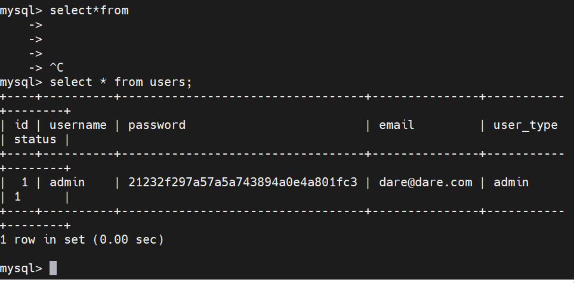
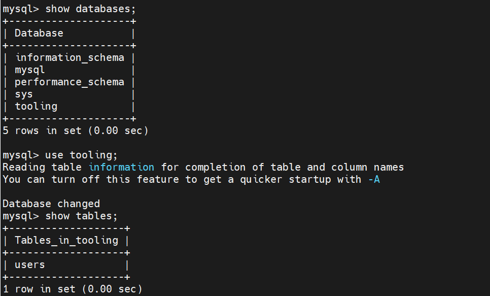

## DEVOPS TOOLING WEBSITE SOLUTION


Setup and technologies used in Project 7
As a member of a DevOps team, you will implement a tooling website solution which makes access to DevOps tools within the corporate infrastructure easily accessible.
In this project you will implement a solution that consists of following components
Infrastructure: AWS
Webserver Linux: Red Hat Enterprise Linux 8
Database Server: Ubuntu 20.04 + MySQL
Storage Server: Red Hat Enterprise Linux 8 + NFS Server
Programming Language: PHP
Code Repository: GitHub
On the diagram below you can see a common pattern where several stateless Web Servers share a common database and also access the same files using Network File Sytem (NFS) as a shared file storage. Even though the NFS server might be located on a completely separate hardware – for Web Servers it look like a local file system from where they can serve the same files.

It is important to know what storage solution is suitable for what use cases, for this – you need to answer the following questions: what data will be stored, in what format, how this data will be accessed, by whom, from where, how frequently, etc. Based on this you will be able to choose the right storage system for your solution.
 

STEP 1 – PREPARE NFS SERVER,Database ubuntu,and three web servers with the same security group.While creating the instances allow for http and https.
Step 1 – Prepare NFS Server
Spin up a new EC2 instance with RHEL Linux 8 Operating System.
Based on your LVM experience from Project 6, Configure LVM on the Server.
Instead of formatting the disks as ext4, you will have to format them as xfs
Ensure there are 3 Logical Volumes. lv-opt lv-apps, and lv-logs
Create mount points on /mnt directory for the logical volumes as follow:
Mount lv-apps on /mnt/apps – To be used by webservers
Mount lv-logs on /mnt/logs – To be used by webserver logs
Mount lv-opt on /mnt/opt – To be used by Jenkins server in Project 8
Install NFS server, configure it to start on reboot and make sure it is up and running
- Open the linux/windows terminal and checked the attached disks. Run:
```
lsblk
```
- Create Partitions on each disk. Run
```
sudo fdisk /dev/nvme1n1
sudo fdisk /dev/nvme2n1
sudo fdisk /dev/nvme3n1
```
- Type n, to create new partition, enter 1 to create 1 partition, p to see the partition details 2048 and w to write the created partition. Select yes to finish.
```
lsblk

Intall lvm2

sudo yum install lvm2
sudo lvmdiskscan
```
- Create Physical volume by marking 3 of the partitioned disks with pvcreate
```
sudo pvcreate /dev/nvme1n1
sudo pvcreate /dev/nvme2n1
sudo pvcreate /dev/nvme3n1
```
- Verify the created physical volumes
```
sudo pvs
```
- Create a volume group to contain all 3 of the created physical volumes with vgcreate. In this case the name is nfs-vg.
```
sudo vgcreate nfs-vg /dev/nvme3n1p1 /dev/nvme2n1p1 /dev/nvme1n1p1
```
- Verify the created volume group
```
sudo vgs
```
- Create 3 Logical Volumes. lv-opt lv-apps, and lv-logs using the lvcreate utility. Allocate 9G each to them. The lv-apps will store website data, lv-gos will store web logs.
```
sudo lvcreate -n lv-apps -L 9G nfs-vg
sudo lvcreate -n lv-logs -L 9G nfs-vg
sudo lvcreate -n lv-opt -L 9G nfs-vg
```
- Confirm the logical volumes
```
sudo lvs
lsblk
```
- Format the disk logical volumes with mfks.xfs.
```
sudo mkfs -t xfs /dev/nfs-vg/lv-apps
sudo mkfs -t xfs /dev/nfs-vg/lv-logs
sudo mkfs -t xfs /dev/nfs-vg/lv-opt
```
- Create /mnt/apps directory to store files
```
sudo mkdir -p /mnt/apps
sudo mkdir -p /mnt/logs
sudo mkdir -p /mnt/opt 
``` 
- Mount lv-apps of /mnt/apps; lv-logs on /mnt/log and lv-opt on /mnt/opt.
```
sudo mount /dev/nfs-vg/lv-apps /mnt/apps
sudo mount /dev/nfs-vg/lv-logs /mnt/logs
sudo mount /dev/nfs-vg/lv-opt /mnt/opt
```
- Update /etc/fstab file

Run
```
sudo blkid
```
- copy the mount ids and update:
```
sudo vi /etc/fstab
```
- Test and reload
```
sudo mount -a
sudo systemctl daemon-reload
```
- Install nfs server, configure and make sure it starts on system reboot
```
sudo yum -y update
sudo yum install nfs-utils -y
sudo systemctl start nfs-server.service
sudo systemctl enable nfs-server.service
sudo systemctl status nfs-server.service
```
- Set permissions to allow read,write and execute.

```

sudo chown -R nobody: /mnt/apps
sudo chown -R nobody: /mnt/logs
sudo chown -R nobody: /mnt/opt
sudo chmod -R 777 /mnt/apps
sudo chmod -R 777 /mnt/logs
sudo chmod -R 777 /mnt/opt

sudo systemctl restart nfs-server.service
```

- Check your subnet cidr – open your EC2 details in AWS web console and locate ‘Networking’ tab and open a Subnet link:
Configure access to NFS for clients within the same subnet using the subnet cidr we got above
```
sudo vi /etc/exports

/mnt/apps <Subnet-CIDR>(rw,sync,no_all_squash,no_root_squash)
/mnt/logs <Subnet-CIDR>(rw,sync,no_all_squash,no_root_squash)
/mnt/opt <Subnet-CIDR>(rw,sync,no_all_squash,no_root_squash)

Esc + :wq!

sudo exportfs -arv


exportfs
```
- Check which port is used by NFS and open its port in security group setting
```
rpcinfo -p | grep nfs
```
- portcheck

- Open port TCP 2049 inbound security group and also, In order for NFS server to be accessible from your client, you must also open following ports: TCP 111, UDP 111, UDP 2049


### CONFIGURE DATABASE
Configure ec2 instance type ubuntu and do these:

- Install MySQL server
```

sudo apt install mysql-server
```

Create a database and name it tooling

Create a database user and name it webaccess

Grant permission to webaccess user on tooling database to do anything only from the webservers subnet cidr.
```
sudo mysql
CREATE DATABASE tooling;
CREATE USER 'webaccess'@'CIDR'IDENTIFIED WITH mysql_native_password BY 'password';
GRANT ALL PRIVILEGES ON *.* TO 'webaccess'@'CIDR'WITH GRANT OPTION;
FLUSH PRIVILEGES;
SHOW DATABASES;
```
```
sudo vi /etc/mysql/mysql.conf.d/mysqld.cnf
```
- bind address: 0.0.0.0
- mysql bind address:0.0.0.0
### WEBSERVERS

- Spin up 3 new REHL 8 ec2 instance in the same subnet as the nfs server

Install NFS client
```
sudo yum install nfs-utils nfs4-acl-tools -y
```
Mount /var/www/ and target the NFS server’s export for apps
```
sudo mkdir /var/www
sudo mount -t nfs -o rw,nosuid <NFS-Server-Private-IP-Address>:/mnt/apps /var/www
```
- Use this to confirm the mount
```
df -h
```
- Edit /etc/fstab file
```
sudo vi /etc/fstab
```
- Add the following to the file setting
```
<NFS-Server-Private-IP-Address>:/mnt/apps /var/www nfs defaults 0 0
```
- Install Remi’s repository, Apache and PHP
```
sudo yum install httpd -y
sudo dnf install https://dl.fedoraproject.org/pub/epel/epel-release-latest-8.noarch.rpm
 
sudo dnf install dnf-utils http://rpms.remirepo.net/enterprise/remi-release-8.rpm
 
sudo dnf module reset php
 
sudo dnf module enable php:remi-7.4
 
sudo dnf install php php-opcache php-gd php-curl php-mysqlnd
 
sudo systemctl start php-fpm
 
sudo systemctl enable php-fpm
 
sudo setsebool -P httpd_execmem 1
```

### Repeat steps 1-5 for another 2 Web Servers.
```
cd /var/www
```
- Create a sample file and verify it on the nfs server.
```
touch test
ls
```
- verify in the nfs server
```
cd /mnt/apps
ls
```
- In your webserver
```
cd ~
sudo mkdir -p /var/log/httpd

sudo mount -t nfs -o rw,nosuid <NFS-Server-Private-IP-Address>:/mnt/logs /var/log/httpd

sudo vi /etc/fstab

<NFS-Server-Private-IP-Address>:/mnt/logs / var/log/httpd nfs defaults 0 0


```
- Fork the tooling source code from Darey.io Github Account to your Github account. (Learn how to fork a repo here)
```
cd ~
sudo yum install git
git init
git clone https://github.com/darey-io/tooling.git
cd tooling/
sudo cp -r html/* /var/www/html/

```
- Do not forget to open port 80 in the edit inbound rules of the webserver.
If you encounter 403 Error:

check permissions on /var/www/html folder
Disable SELinux sudo setenforce 0
To make this change permanent, open selinux config file and set SELINUX=disabled then restrt httpd.
```
sudo vi /etc/sysconfig/selinux
```
Update the website’s configuration to connect to the database
```
sudo vi /var/www/html/functions.php
```
$db = mysqli_connect('database private ip','webaccess','password','tooling')
```
sudo yum install httpd
```
- Install mysql-client 
```
sudo yum install mysql
```
- Apply tooling-db.sql script to your database using this command
``` 
mysql -h <databse-private-ip> -u <db-username> -p <db-name> < tooling-db.sql
```

 
 ```
 sudo systemctl status httpd
 sudo systemctl start httpd
 ```
 - Confirm if this worked in the DB-Server
 - Do not forget to open port 3306 on the database web server.

 

 

 
 ```
sudo systemctl restart mysql
sudo 
show databases;
use tooling;
show tables;
select * from users;
```


- Congratulations! We have just implemented a web solution for a DevOps team using LAMP stack with remote Database and NFS servers.


